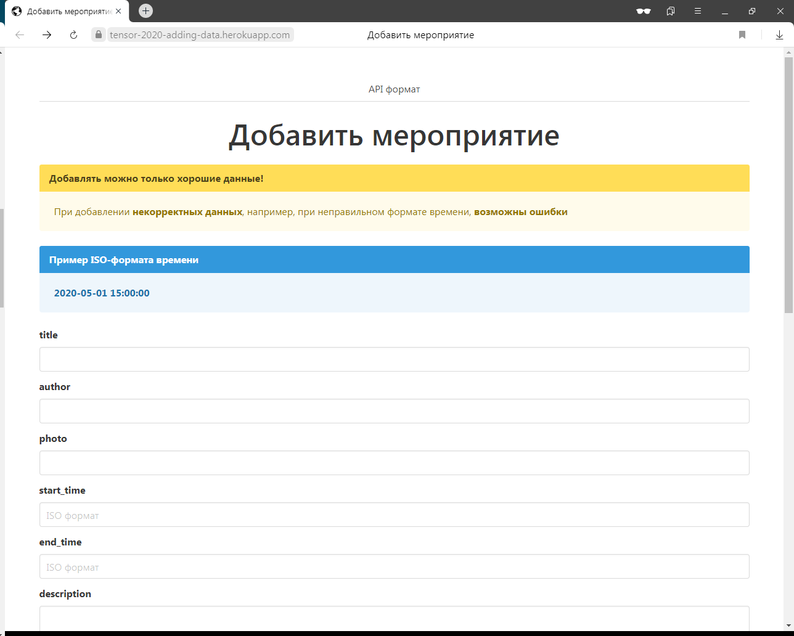
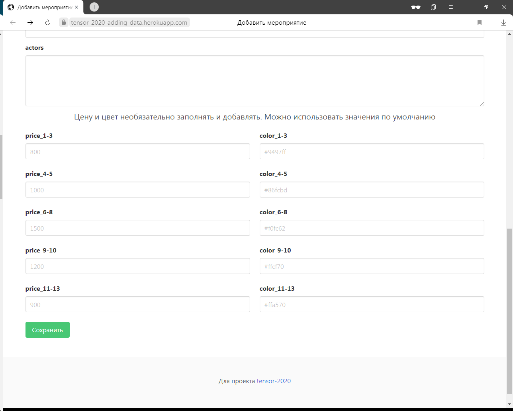
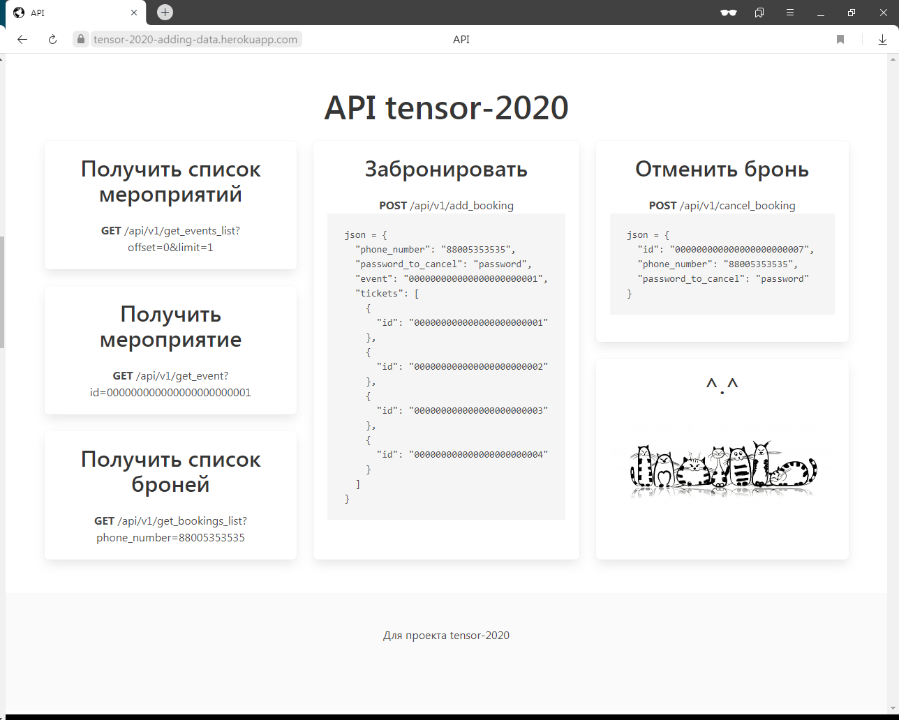

# Вспомогательное двухстраничное приложение для проекта "Билетная касса театра"

https://tensor-2020-adding-data.herokuapp.com/

* Добавление данных о предстоящих мероприятиях в БД сайта [Билетная касса театра](https://tensor-2020.herokuapp.com)

* Примеры запросов к API: GET, POST + JSON

---

### [Добавление мероприятий в БД](https://tensor-2020-adding-data.herokuapp.com/)

    

    

### [Примеры запросов к API: GET, POST + JSON](https://tensor-2020-adding-data.herokuapp.com/dev)

    

